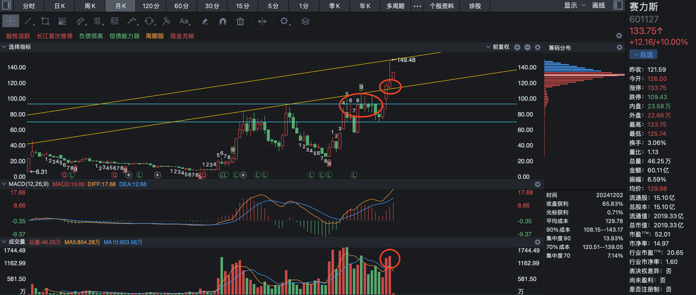
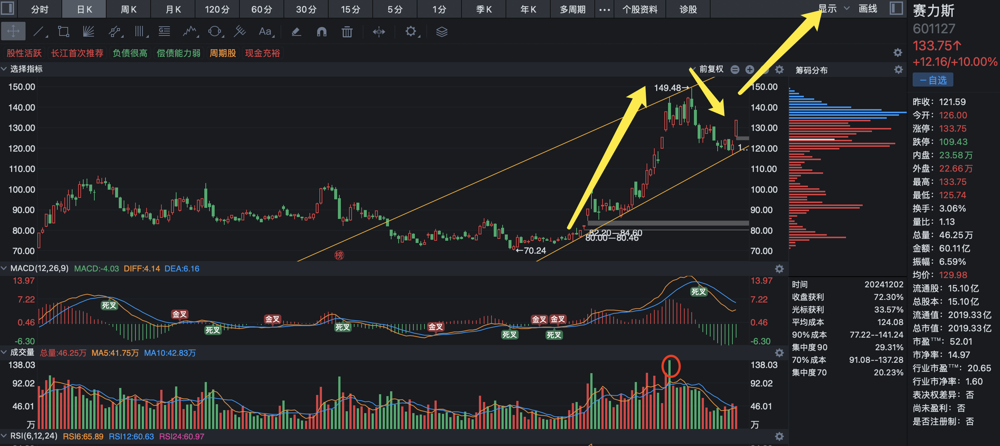
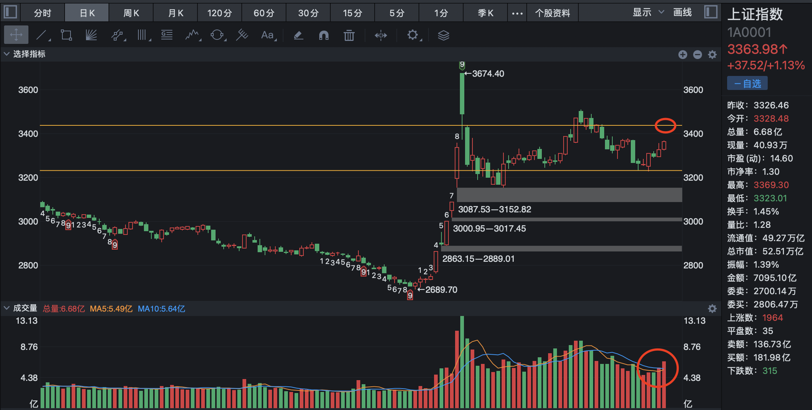

# 2024-12-2

从月 K 上分析，赛力斯在 10 月份放量有效突破了整理了 11 个月的震荡平台，突破之后，压制线转变为支撑线，并向上打开新的上升通道，在 11 月份到达 112 的价位即原有的压制线的位置也可以验证这一点。

这是一次成功的挑战，突破，确认。

至于新的上升通道的上沿在什么位置，等到放巨量的那个月见分晓，目前看 150 的位置并没有明显的放量，个人判断这波行情根据关键点理论，会在 200 左右放量调整。

从日 K 上分析，在经历了 2 个月的平台整理之后，正式开启第一浪，并在 149 左右进入 2 浪调整，今天正式缩量涨停，有开启三浪主升浪的迹象，也证明了 150 并不是这轮的目标。

明天的策略，继续持有，大概率继续涨停，如果明显放量，则要小心，很有可能回补缺口，冲高做 T，一直回调到 120 左右。

上证指数成交量温和放大，目前任然处于震荡区间，区间上沿留意 3437 出的成交量情况，如果放量突破，则为有效突破，等待之后回调确认即可。
