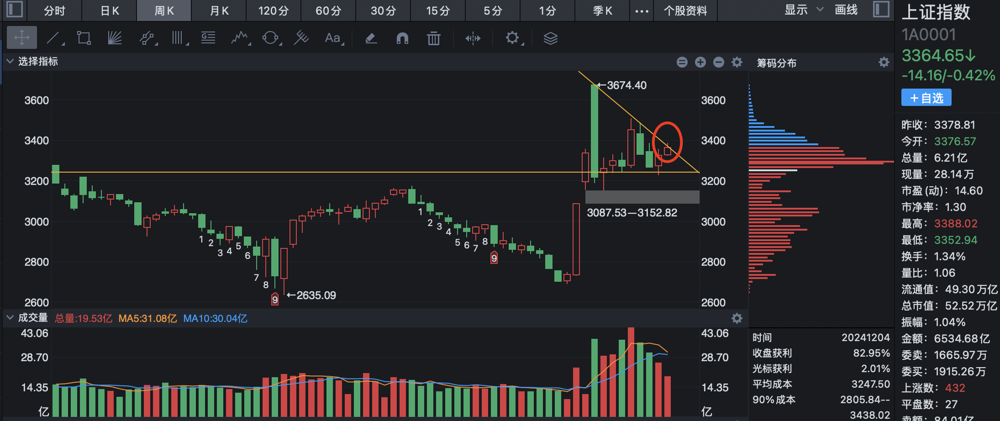
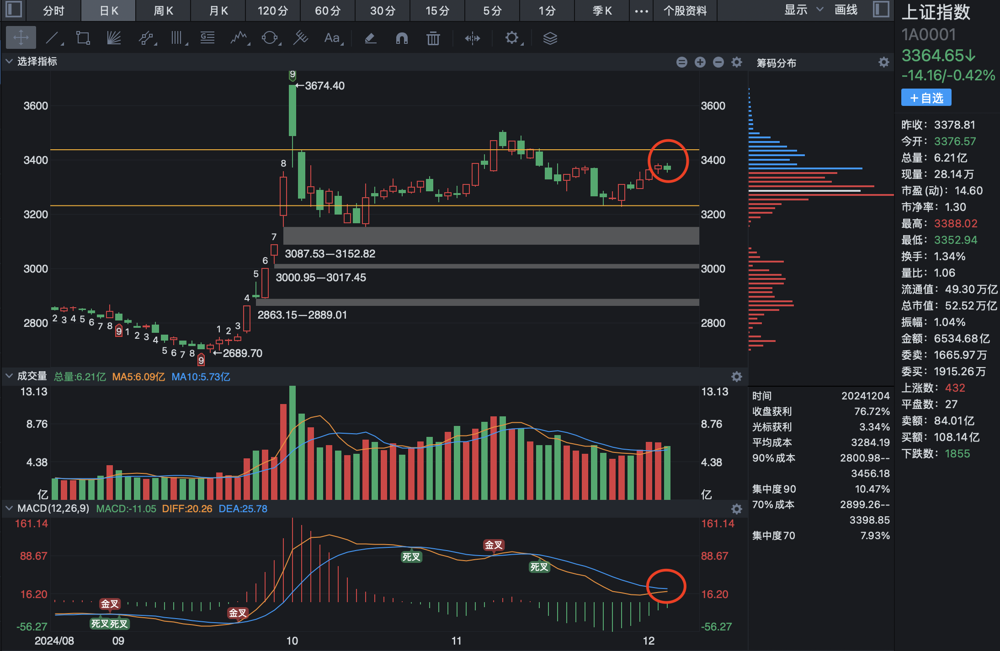
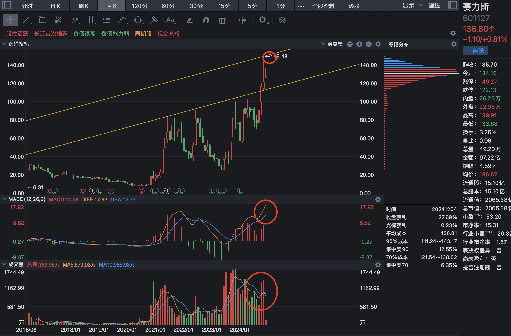
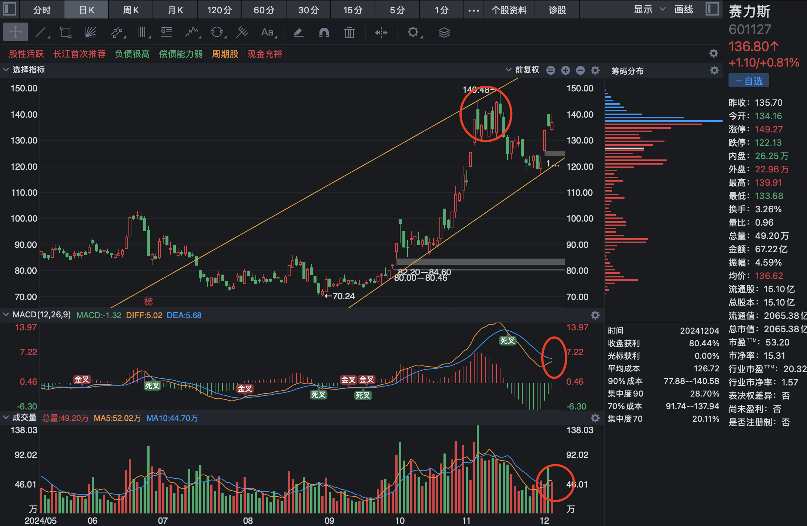

# 2024-12-4

今天上证指数遇到周 K 趋势线压制，稍有回落。

但是从日 K 上看，仍然处于震荡区间见，正常缩量微调。

预计明后天将明显放量，到达 3437 的位置。

明天的策略 3400 点附近是一个良好的 T 点。

赛力斯的月趋势处于量价齐升的健康趋势中，150 的位置一个较为稳妥的 T 点。

从日 K 上分析，今天在前期 140 的位置震荡，成交量缩量明显，说明这个位置的阻力的力量在逐渐变小。

明天的策略，留意成交量，如果成交量明显放大，则说明阻力位置调整结束，即将开始突破拉升，如果成交量继续缩小，则说明还在调整的过程当中。
