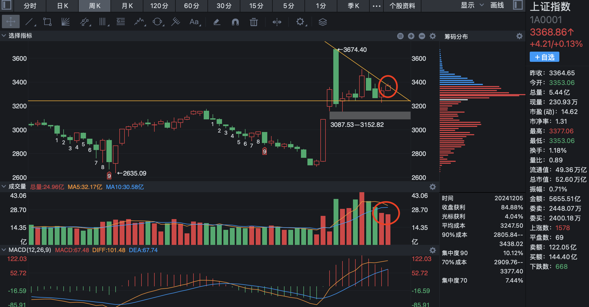
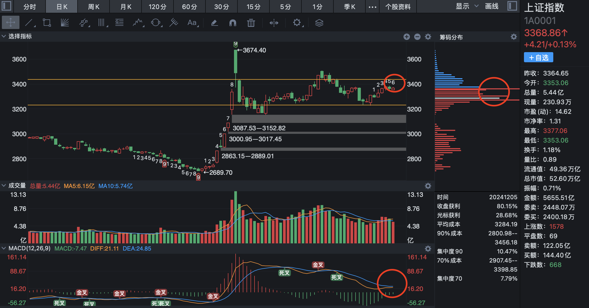
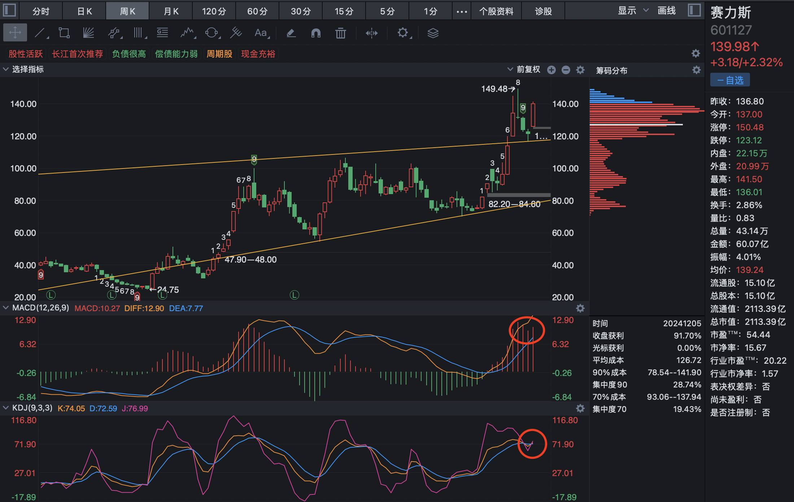
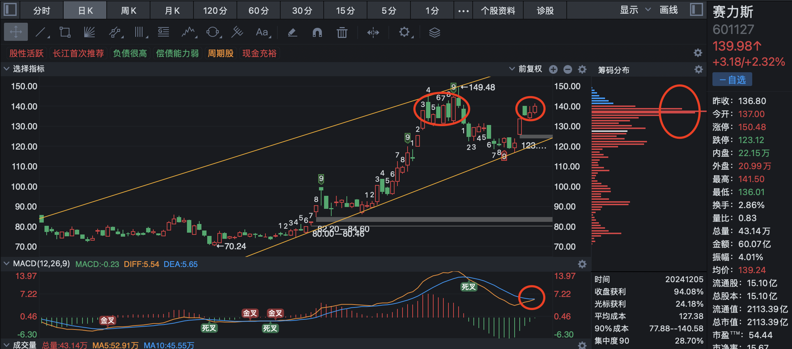

# 2024-12-5

今天和预期走势相符，账户也盈利 2 个多点，只不过振幅过小，没有给 T 的机会。

上证指数今天收在了周趋势线的短期阻力线位置，从日 k 上分析，筹码进一步聚集，一触即发，并且即将金叉。

赛力斯周线 MACD 进行了一次成功的逼空，并且 KDJ 金叉，日线上看，140 位置筹码进一步收集而非出货，重要指标 MACD 金叉。

明天策略：预测股市大阳，如果早盘低开，则要果断进场，并且关注成交量的变化。
