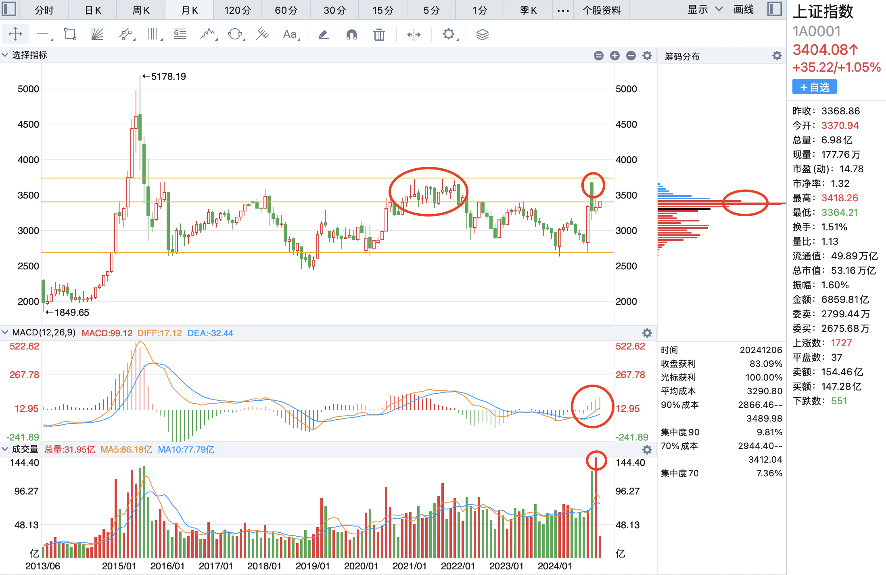
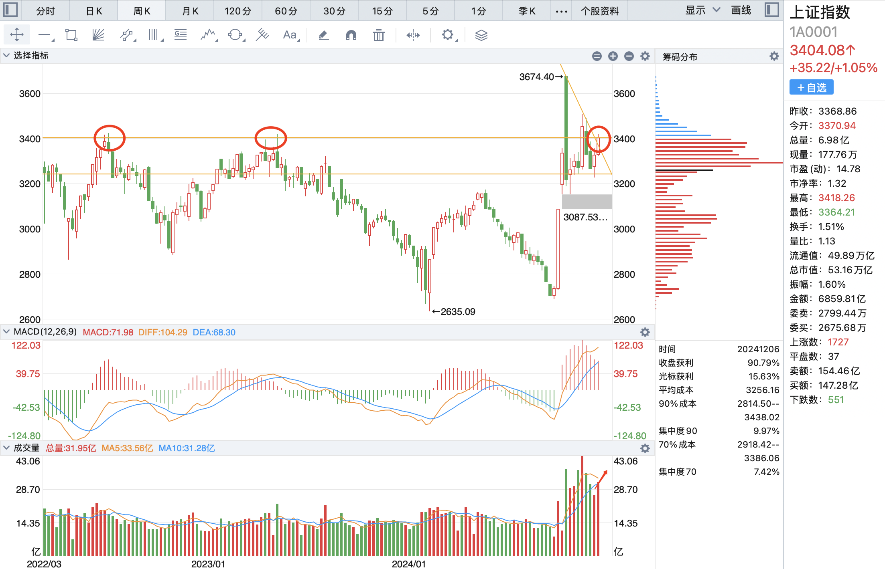
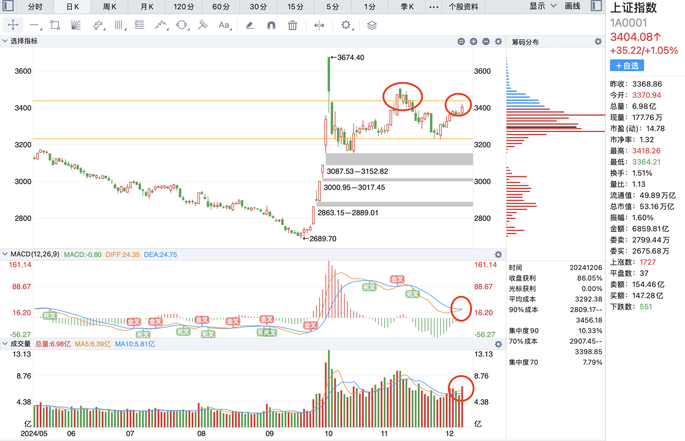
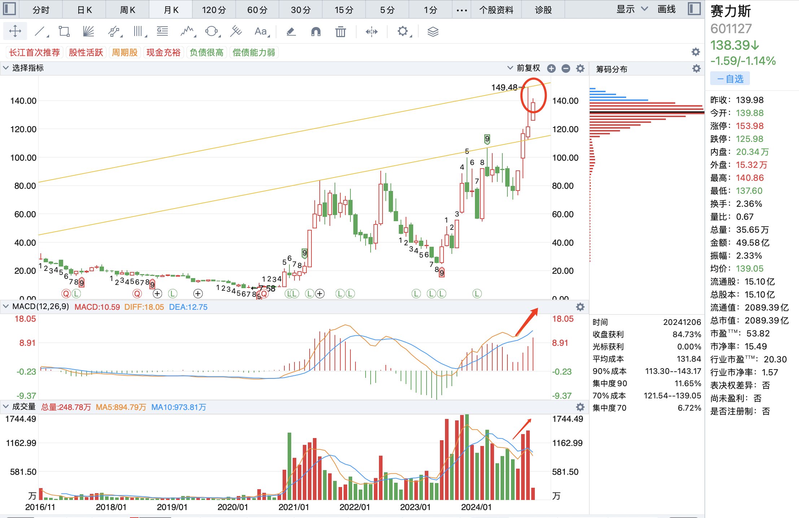
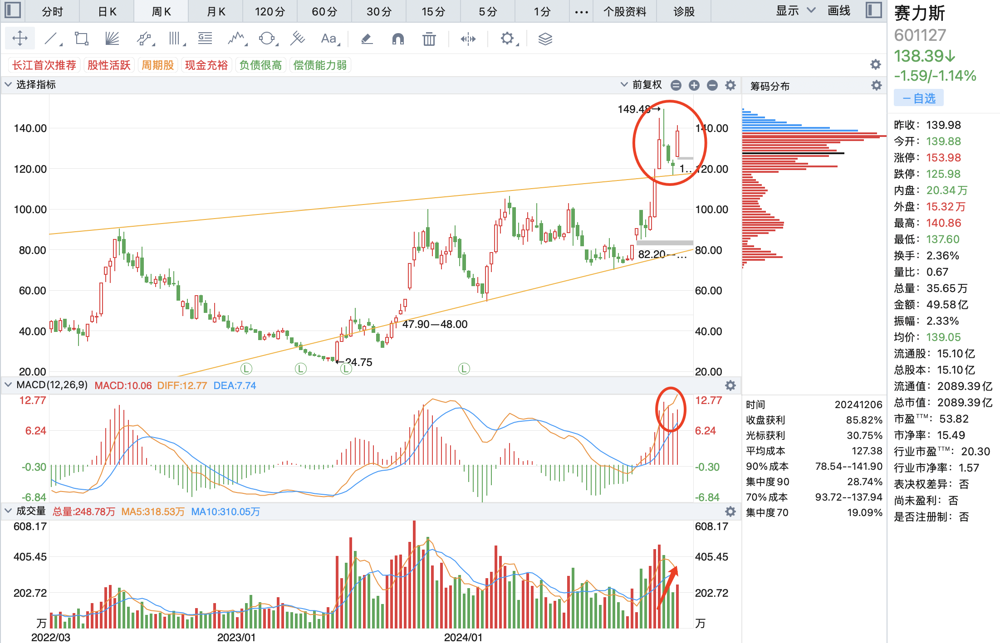

# 2024-12-6

今天 T 了两次，成功了一次，后又 T 高了一次，在大盘大涨的行情下，目前仓位全仓。

上证指数在 10 月和 11 月遇到前期筹码密集处，成交量达到了历史天量，说明这个位置的压力已经充分得到了释放，从指标上来看，处于升势的底部，后期看涨。

上证指数本周放量突破了压力趋势线，并且横向站上了前期震荡高点，是一个良好的趋势，和月 K 一样，共同验证了涨的信号。

上证指数日线图上，先是缩量调整，然后今天放量大涨，并且即将形成金叉。

综上所述，上证指数从日周月三个趋势上共同验证了涨的信号。

赛力斯月线上温和放量，量价齐升，走势良好，并且前期有明显的逼空行为。

周线上有明显的逼空，经历了缩量回调，然后温和放量的过程。

日线上目前处于缩量回调的过程，MACD 金叉，处于上升通道的中间分歧的位置。这个分歧最终的结果是一致的缩量回调，也就是等待不坚定者出局，目前来看分歧已过。

策略：下周看涨，指数在 3731 左右的位置附近可 T，会产生分歧，150 左右的位置也会产生分歧，轻仓 可 T。
