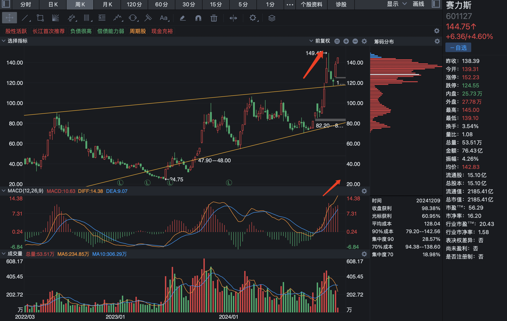

# 2024-12-9

见证历史的一天，今天收盘之后政府楼市重磅利好会议，港股中概股直线拉升，明天即将千股涨停，见证历史的时刻，中国股市正式崛起了。

上证指数从月线上看，才刚刚开始启动，3731 点是前期高点，可能会有短暂的分歧，不过可以忽略，在极致的热情面前，这个阻力不足挂齿。

周线量价齐升，和月 K 一样，在 3731 处为前期分歧震荡位置。

日线也验证了 3731 处的震荡区间，为前期分歧的位置，这个位置需要果断的突破和温和的放量，而不是天量，天量意味着摆脱这个震荡区间耗费了大量的能量，容易后劲不足。

赛力斯一样，月线上有明显的逼空行为，并且很明显才刚摆脱了前期为期将近一年的震荡区间，涨势才刚刚开始。

周线在逼空之后量价齐升，逼空往往意味着大行情。

从日线的上升通道来看，还有很大的上升空间，并且刚刚形成金叉。
