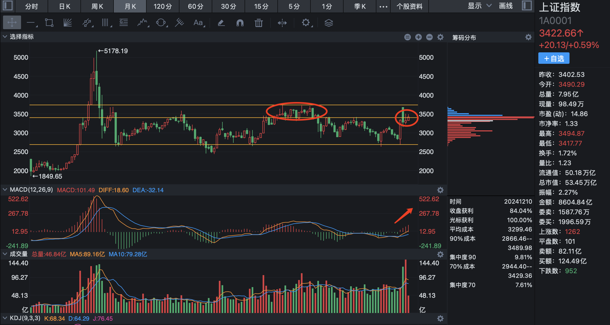
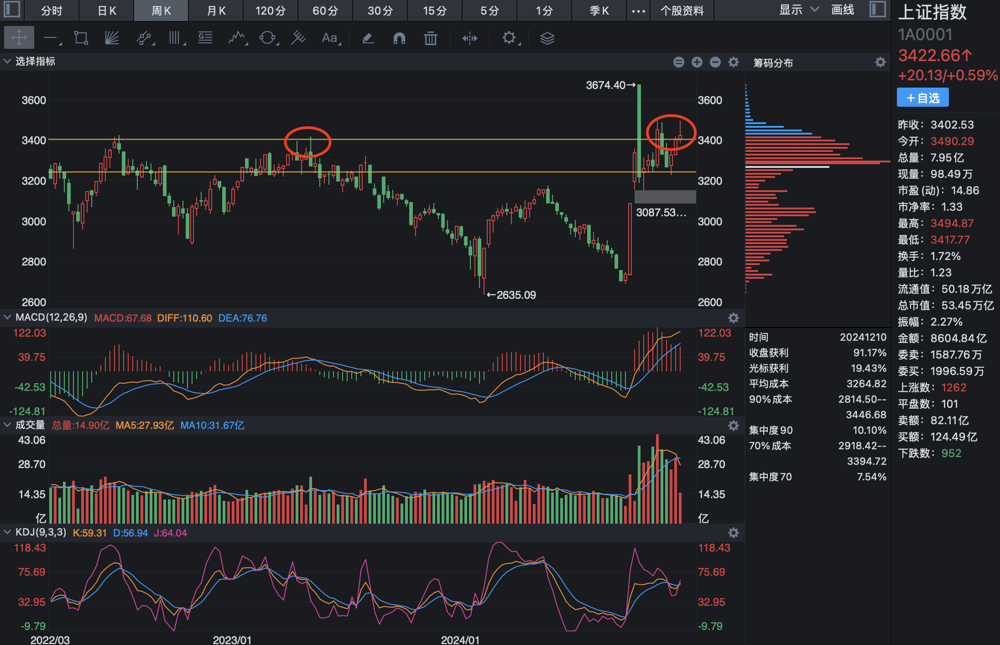
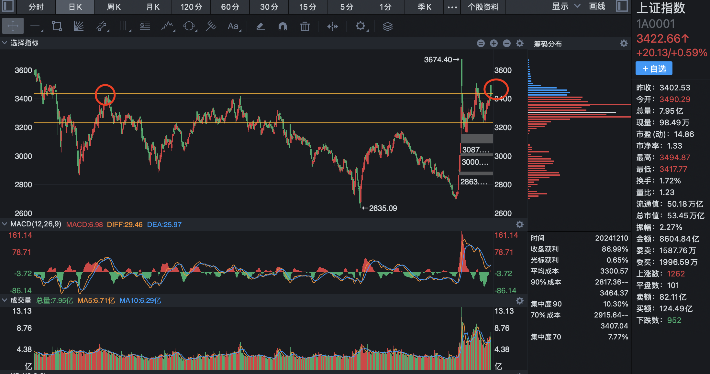
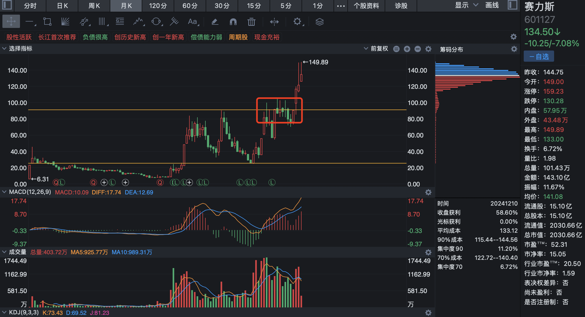
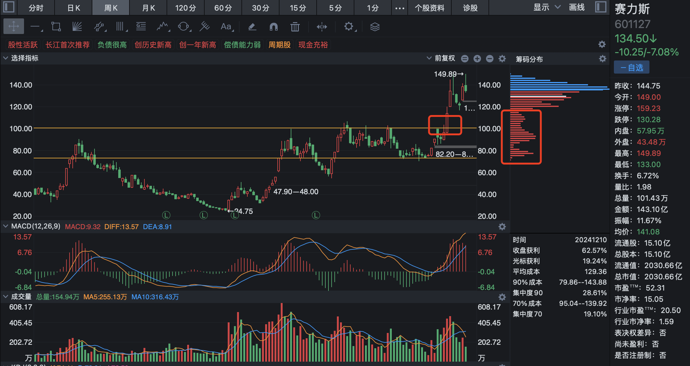
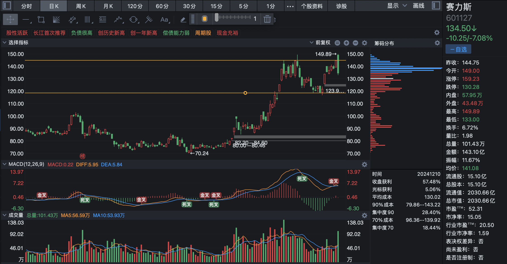

# 2024-12-10

月线上，今天上证指数遇到前期震荡区间，迅速回落，目前是微微突破的态势。

周线上经历了前期的突破，回踩，确认，今天也收在了前期高点的上方。

日线上刚刚好回落在前期高点附近。

上证指数正在温和健康的突破中。

赛力斯从月线上看，摆脱了前期的震荡区间，从 90.5 开始，正在向上打开新的上涨空间。连着两个月温和放量上涨，虽然收了长上影线，

从周线上看，也是摆脱了前期的震荡区间，正在向上打开空间，并且在突破后连跌三周，有明显的回踩动作，有明显的逼空动作，这里的调整节奏很紧凑，很快，很有可能走出杯柄的形态，走出超级大行情。

从日线上看，目前正处于 149 到 120 之间来回震荡，不排除继续往下震荡的可能性，不论怎样，120 都是一个绝佳的买点。
