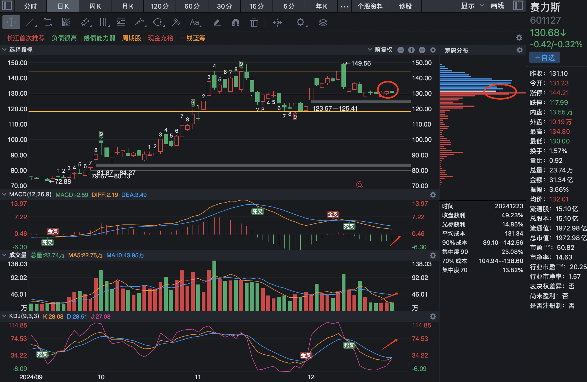
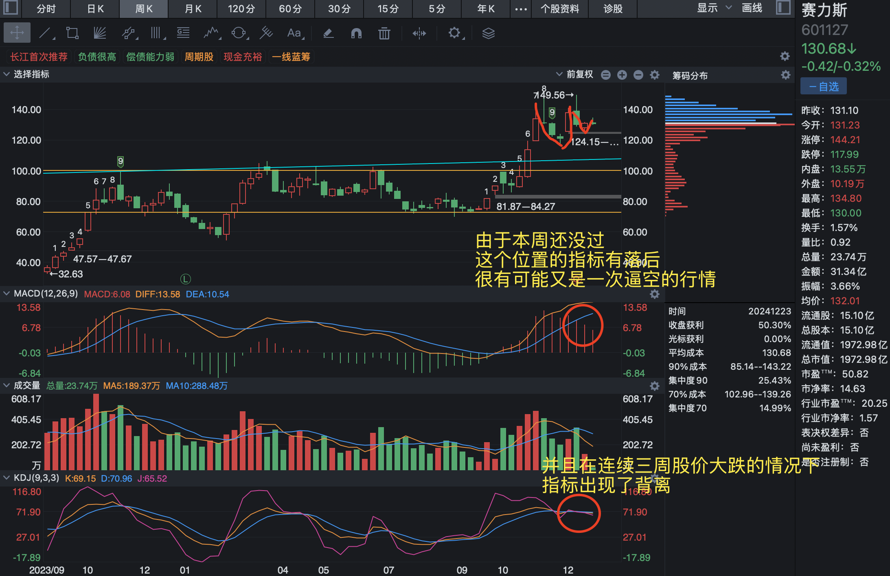
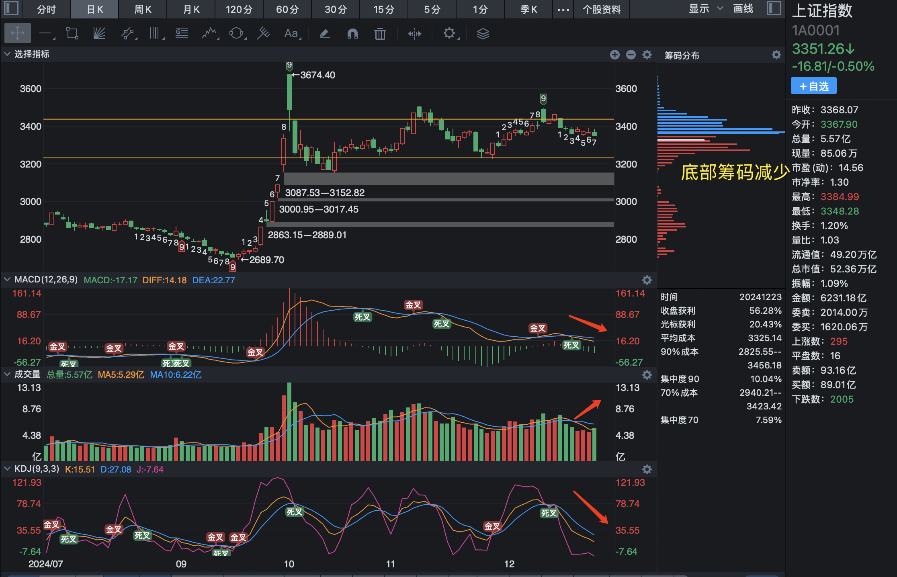

# 2024-12-23

今天离开了待了六年的公司，即将开启新的人生阶段。其实人生和打仗下棋差不多，有手头有限的资源，打更多的胜仗或者吃掉更多的棋子。所以对人生的起起落落，无可厚非，也没有必要过度的感情用事。在不同阶段打好仗，下好棋即可。

赛力斯日线上一直在 130 处积累筹码，底部筹码没有松动的迹象，各类指标都在慢慢变好，并且成交量在温和的放大。今天开盘最高摸了一下 134.8 的位置，随后回落收出了一根长上影线，个人判断这条长上影线属于挑战，试试前期震荡位置的抛压，后面随着成交量的正式放大，将形成有效突破。

赛力斯从周线来看，离杯柄形态越来越接近，目前正在形成杯柄的阶段，而且连续的几周节奏很紧凑。

从指标上来看，有部分的背离，但是由于今天才周一，不排除上周为一次逼空行为。并且之前连续三周的大跌，KDJ 指标出现了背离。

上证指数从筹码上看，底部筹码今天明显减少，可以理解为利空，但是同时也是一种利好，就是前行的担子轻了，目前任然处于震荡区间内，但是这个位置出现了一定的底背离，指标的下跌不明显，而且自从挑战了震荡区间的上沿之后，并没有出现明显的下跌，反而有止稳的迹象，因此我判断这个位置不能盲目的看空，很有可能一根大阳线实现突破，一口气冲破之前的 3674 的点位。
